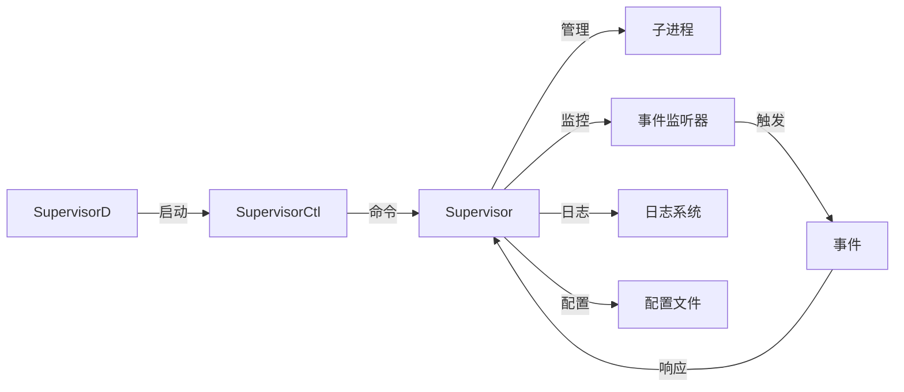

本文详述了进程管理工具 `supervisor` 的使用，从进程的基本概念到如何配置和管理进程，提供了从安装到实际应用的全面指南。文中比较了 `nohup` 和 `supervisor`，展示了 `supervisor` 在自动重启、日志管理和进程监控等方面的优势。

<!-- more -->

## 进程

进程指的是一个程序在操作系统中**运行时的实例**。程序本身是静态的代码和数据，而进程则是程序的动态表现形式，包括执行的指令、分配的资源和运行时的状态。

* 程序 vs 进程
  * **程序**是保存在磁盘上的指令集合，是静态的。
  * **进程**是程序的一次执行，是动态的，它包含程序的指令、运行时的资源和状态。

**进程的生命周期**

进程在创建到销毁的过程中，都会经历五种状态的转换

:::center


:::

* 创建：进程在创建时需要申请一个空白PCB，向其中填写控制和管理进程的信息，完成资源分配。如果创建工作无法完成，比如资源无法满足，就无法被调度运行，把此时进程所处状态称为创建状态。
* 就绪：进程已经准备好，已分配到所需资源，只要分配到CPU就能够立即运行。
* 执行：进程处于就绪状态被调度后，进程进入执行状态。
* 阻塞：正在执行的进程由于某些事件（I/O请求，申请缓存区失败）而暂时无法运行，进程受到阻塞。在满足请求时进入就绪状态等待系统调用
* 终止：进程结束，或出现错误，或被系统终止，进入终止状态。无法再执行

## 前台进程和后台进程

在操作系统中，进程通常可以分为**前台进程**（foreground process）和**后台进程**（background process）。这两者的区别主要体现在它们如何与终端交互、如何占用系统资源以及如何管理。

> **前台进程**

**前台进程**是指与用户的终端会话直接交互的进程。通常，这些进程会占用当前终端的控制权，直到它们执行完毕。

**特点**：与用户交互、占用终端、阻塞式运行

> **后台进程**

**后台进程**是指不会直接与用户交互，而是将控制权交还给终端的进程。后台进程在运行时不占用终端，可以让用户继续在同一终端上运行其他命令。

**特点**：不与用户交互、不阻塞终端

> **适用场景**

**前台进程**：

- 适合需要用户输入或输出的任务，比如交互式命令、编辑文件、编译程序等。
- 用户需要等待进程完成才能继续其他操作。

**后台进程**：

- 适合需要长时间运行、不需要用户干预的任务，如：
  - 数据备份
  - Web 服务器、数据库服务等守护进程
  - 定时任务（例如，cron 作业）
  - ...

## 如何将前台进程转为后台进程

>常见的两种方法：

**方法 1：在命令后加 `&`**

这样可以把这个命令放到后台执行，例如：每10s在后台执行一次test.sh脚本

`watch -n 10 sh test.sh &` 

但是这种缺点是如果我们关闭当前终端，此进程也会被杀死。

**方法 2：nohup**

如果让程序始终在后台执行，即使关闭当前的终端也执行，这时候需要nohup。

nohup 命令可以将程序以<mark>忽略挂起信号(SIGHUP)</mark>的方式运行起来，被运行的程序的输出信息将不会显示到终端。

无论是否将 nohup 命令的输出重定向到终端，输出都会将写入到当前目录的 nohup.out 文件中。如果当前目录的 nohup.out 文件不可写，则输出重定向到 $HOME/nohup.out 文件中。

## nohup

`nohup`是Linux和Unix系统中的一个命令，其作用是在终端退出时，让进程在后台继续运行。它的全称为“no hang up”，意为“不挂起”。`nohup`命令可以让你在退出终端或关闭SSH连接后继续运行命令。

**基本语法格式：**

```bash
 nohup Command [ Arg … ] [　& ]
```

Command：要执行的命令。

Arg：一些参数，可以指定输出文件。

&：让命令在后台执行，终端退出后命令仍旧执行。

### 执行过程

nohup命令的执行过程分为以下几个步骤：

1. 屏蔽挂起信号：

   `nohup` 命令会让目标进程忽略终端关闭时发送的挂起信号（SIGHUP），确保进程不会因终端关闭而中断。

2. 重定向输出：

   如果没有手动指定，`nohup` 会将进程的输出和错误信息保存到 `nohup.out` 文件中。

   如果指定了重定向，则输出按用户的配置保存。

3. 启动目标进程：

   `nohup` 调用目标程序并将其作为一个独立进程运行。

4. 后台运行（可选）：

   使用 `&` 可以将进程放入后台执行，不占用终端。

### 常见的使用方法

1. 后台运行命令

   ```bash
   nohup COMMAND &
   
   # 例如：在后台运行一个Bash脚本
   nohup bash test.sh &
   ```

2. 标准输出重定向到文件

   ```bash
   nohup bash test.sh > stdout.txt &
   ```

3. 标准错误输出重定向到文件

   ```bash
   nohup bash test.sh 2> stderr.txt &
   ```

4. 将标准输出和标准错误输出都重定向到文件

   * 重定向到同一文件

     ```bash
     nohup bash test.sh > output.txt 2>&1 &
     ```

   * 重定向到不同文件

     ```bash
     nohup bash test.sh > stdout.txt 2> stderr.txt &
     ```

5. 使用 `jobs` 命令可以查看当前 shell 中后台运行的任务列表，包括任务编号、状态和命令。并使用`fg`命令将进程切换到前台运行

### nohup的不足

`nohup` 有很多优点：

1. 简单：`nohup` 非常简单易用，适用于快速启动一个不需要复杂管理的后台任务。
2. 不需要额外安装：在大多数 Unix 或 Linux 系统上，`nohup` 是默认安装的，不需要额外配置。
3. 资源占用低：`nohup` 本身不会占用太多系统资源。

但是`nohup`的缺点也很明显：

1. **无进程管理**：一旦进程启动，`nohup` 不会提供任何监控或管理功能。如果进程挂掉，它不会自动重启。
2. **日志管理不便**：虽然 `nohup` 可以将输出重定向到文件，但日志文件管理（如日志轮转、压缩等）需要额外的手动配置。
3. **缺乏恢复机制**：如果进程因为某些原因退出，`nohup` 不会尝试重启或通知用户。
4. **不支持多进程**：`nohup` 一次只能启动一个进程，不适合管理多个相关的服务或进程。

### 常用拉起进程的方式

使用 `nohup` 运行的后台进程如果意外挂掉，通常使用定时任务来检查并重启进程。下面是一个简单的例子：

```bash
# 使用 nohup 启动一个进程
[root@test nohup]# nohup ./process 2>&1 &
[1] 7384
```

1. 监控脚本`/root/nohup/process_monitor.sh`：

   ```shell
   #!/bin/bash
   
   PROCESS_NAME="process"
   
   if ! pgrep -x "$PROCESS_NAME" > /dev/null
   then
       # 如果进程不存在，则启动它
       echo "$(date): Starting $PROCESS_NAME" >> /var/log/process_monitor.log
       nohup /root/nohup/process 2>&1 &
       echo $! > /var/run/process.pid  # 将新进程的PID保存到文件中 
   else
       echo "$(date): $PROCESS_NAME is already running" >> /var/log/process_monitor.log
   fi
   ```

2. 使用for循环监控并重复执行监控脚本：`/root/nohup/monitor.sh`：

   ```shell
   #!/bin/bash
   
   # 定义循环次数（每10秒检查一次，6次为一分钟）
   for i in {1..6}; do
       /root/nohup/process_monitor.sh
       sleep 10
   done
   ```

3. 设置 `crontab` 创建定时任务

   使用 `crontab -e` 编辑你的定时任务，添加以下行：

   ```bash
   * * * * * /root/nohup/monitor.sh
   ```

 若进程被杀死后在10秒内会被自动拉起：

```bash
[root@test nohup]# kill -9 7384
[root@test nohup]# ps -ef|grep process
root        7438    5828  0 11:10 pts/1    00:00:00 grep --color=auto process

# 几秒后成功拉起了进程
[root@test nohup]# ps -ef|grep process
root        7444       1  0 11:10 ?        00:00:00 /root/nohup/process
root        7450    5828  0 11:10 pts/1    00:00:00 grep --color=auto process
```

<mark>**这种方式的缺点：**</mark>

使用这种方法（即创建监控脚本、for 循环脚本和 `crontab` 定时任务）来监控和恢复进程有以下几个潜在的缺点：

1. **复杂性增加**

   * 多层脚本：需要管理多个脚本，这增加了系统的复杂性。每个脚本都需要单独维护、测试和更新。

   * 依赖性：脚本之间的依赖关系可能导致问题。

2. **性能和资源使用**

   * 频繁检查：每10秒检查一次进程状态可能会对系统性能造成一定的压力，特别是在高负载环境中。即使每个检查操作很轻量，累积的效果也可能显著。

   * 资源占用：如果不正确管理，可能会有多个脚本实例同时运行，导致资源浪费。

3. **可靠性和稳定性**

   * 脚本失效：如果任何一个脚本（特别是 loop_monitor.sh）因某种原因失败或被终止，整个监控和恢复机制就会失效。
   * 定时任务的限制：crontab 只能精确到分钟级别，因此使用 for 循环来实现更短的时间间隔可能会导致在某些情况下无法及时响应进程终止。

4. **扩展性和可维护性**

   * 维护成本：随着时间的推移，维护多个脚本可能变得复杂，尤其是在需要添加新功能或修改现有逻辑时。

## 进程监控工具

在相对复杂的环境中，建议**考虑使用更专业的监控和管理工具**：如 `systemd`、`supervisord`、`Monit` 等，这些工具提供了更好的进程管理、自动恢复、日志管理和性能监控功能。

`systemd` 和 `supervisord` 都是用于管理和监控系统服务的工具，但它们有不同的设计目标、功能集和使用场景。

**在功能用途上：**

* **`systemd`**：

  - 是 **Linux 系统的初始化系统和服务管理器**，不仅用于启动和管理系统服务，还管理系统的整体启动过程，包括用户会话、硬件设备、网络服务等。

  - 它负责处理系统级别的服务、进程、硬件设备、日志管理等。其核心功能远超进程监控和管理。

  - **跨越多个进程的管理**：`systemd` 可以管理依赖关系、系统启动顺序等，适用于复杂的多进程服务。

  - 提供丰富的服务管理选项，如日志收集、资源限制、进程优先级控制等。

* **`supervisor`**：

  - 是一个 **进程控制系统**，专注于管理后台进程（通常是用户级别的进程）。

  - 它适用于监控和重启独立的进程，尤其在应用程序需要高度控制的场景中（例如 Web 应用、后台服务）。

  - **进程监控和自动重启**：`supervisor` 可以启动、停止、重启进程，并监控它们的状态。

  - 不涉及系统初始化、硬件管理等低级任务。

**在适用场景上：**

* **`systemd`**：

  - 用于 **操作系统级别的服务管理**，适合管理系统启动过程中的所有服务，涵盖底层和应用级别的进程管理。

  - **适用范围**广泛，不仅适合进程监控，还用于管理网络、硬件、用户会话等系统资源。

  - `systemd` 提供的 **服务管理功能**更加强大和细粒度，适用于需要跨服务的依赖管理和启动顺序的复杂系统。

* **`supervisor`**：

  - 适用于 **用户级的后台进程监控**，特别是在需要快速部署和控制多个应用进程时。

  - **进程管理和自动重启**功能较为简洁、易于配置，非常适合开发和生产环境中需要监控的服务（如 Web 应用、任务调度等）。

  - 适合 **小规模或中等规模的应用监控**，不涉及操作系统级别的管理。

| 特性             | systemd                                    | supervisor                         |
| ---------------- | ------------------------------------------ | ---------------------------------- |
| **适用范围**     | 系统服务、硬件管理、进程管理等             | 主要用于管理用户级进程             |
| **配置复杂度**   | 配置文件语法复杂，功能强大                 | 配置简单，易于上手                 |
| **依赖关系管理** | 强大的依赖关系和启动顺序管理               | 不支持复杂依赖关系                 |
| **日志管理**     | 内建日志管理（`journalctl`）               | 基本的日志管理（配置文件定义）     |
| **资源管理**     | 支持CPU、内存、网络等资源限制              | 资源管理较弱                       |
| **适用场景**     | 系统服务、复杂服务管理、需要高可靠性的环境 | 简单进程监控、小规模应用、开发环境 |

## supervisor

`Supervisor` 是一个开源的进程管理和监控工具，主要用于控制和管理后台进程。它允许用户启动、停止、重启进程，并监控进程的状态。`Supervisor` 提供了简单的配置文件和命令行接口，可以有效地管理独立的后台应用进程，确保它们在崩溃后自动重启，且易于集成到应用程序的运维中。

它特别适用于开发和生产环境中的应用程序和服务管理，能够帮助开发人员快速控制应用进程的生命周期。

**核心组件**

1. **`supervisord`**：是 `Supervisor` 的核心守护进程，负责启动、停止和监控子进程。它通常作为一个后台服务运行，并管理一个或多个进程。
2. **`supervisorctl`**：是 `Supervisor` 的命令行工具，用于与 `supervisord` 进程进行交互。用户可以通过它来控制进程的启动、停止、重启和查看进程的状态。
3. **配置文件**：`Supervisor` 的配置文件通常是一个简单的文本文件（默认路径 `/etc/supervisord.conf`），用户通过它来定义要管理的进程和配置。

**主要功能：**

* 进程管理：可以启动、停止、重启单个或多个进程，支持后台运行。

* 自动重启：当被监控的进程崩溃时，`Supervisor` 会自动尝试重新启动它。

* 进程日志管理：可以指定标准输出和标准错误日志的存储路径，方便日志管理和调试。

* 进程组管理：支持管理一组进程，通过一个命令同时启动、停止或重启多个进程。

* 实时监控：可以通过 `supervisorctl` 查看进程的状态，确认哪些进程在运行，哪些进程停止或崩溃。

### 安装

> 使用包管理器安装

<code-group>
  <code-block title="Debian/Ubuntu" active>

```bash
sudo apt-get install supervisor
```

  </code-block>

  <code-block title="CentOS/RHEL">

```bash
sudo yum install supervisor
```

  </code-block>

<code-block title="pip">

```bash
pip install supervisor
```

</code-block>

</code-group>

::: tip
本文主要介绍编译安装的方式
:::

**无网环境编译安装**

内网安装可以下载 tar 包本机编译安装

1. 准备工作

   **从有网络环境中下载 `Supervisor` 的源码包**： 你可以从 `Supervisor` 的官方网站或 GitHub 仓库中下载源码包。下载 `tar.gz` 文件。然后，将下载的 `tar.gz` 文件传输到无网络环境的机器上

   **确保无网络环境下有必要的依赖**： 在编译 `Supervisor` 之前，目标机器需要安装一些开发工具和依赖包，比如 `Python` 和 `setuptools`、`pip`等。

2. 安装

   ```bash
   [root@test soft]# ls
   supervisor-4.2.5.tar.gz
   [root@test soft]# tar zxf supervisor-4.2.5.tar.gz 
   [root@test soft]# cd supervisor-4.2.5/
   [root@test supervisor-4.2.5]# python setup.py install
   ```

   如果没有错误，`Supervisor` 将被安装到系统的 Python 库路径中。

3. 配置和启动supervisor

   1. 创建配置文件：安装完成后，你可以创建 `supervisord` 的配置文件（通常在 `/etc/supervisord.conf` 或 `/etc/supervisor/supervisord.conf`）。

      这里我与官方建议的不同：

      ```bash
      mkdir -p /utxt/soft/supervisor
      ```

      在该目录下创建`conf`和`log`两个目录，`conf`用于存放管理进程的配置，`log`用于存放管理进程的日志。

      ```bash
      cd /utxt/soft/supervisor/
      [root@test supervisor]# mkdir conf log
      [root@test supervisor]# ls
      conf  log
      ```

      创建一个主配置文件，使用`include`指令加载其他配置文件：

      ```bash
      vim /utxt/soft/supervisor/supervisord.conf
      ```

      ```ini
      [unix_http_server]
      file = /var/run/supervisor/supervisor.sock
      
      # 可以设置web界面，不过不常用
      [inet_http_server]
      #启用 HTTP 服务，监听某个端口（例如 9001）
      port = 127.0.0.1:9001
      # 设置 Web UI 的用户名和密码（可选）
      username = admin
      password = yourpassword
      
      [supervisord]
      logfile=/var/log/supervisord.log
      pidfile=/var/run/supervisord.pid
      
      ; 定义RPC接口
      [rpcinterface:supervisor]
      supervisor.rpcinterface_factory = supervisor.rpcinterface:make_main_rpcinterface
      
      
      [supervisorctl]
      serverurl=unix:///var/run/supervisor/supervisor.sock
      
      # 通过 include 加载所有的程序配置
      [include]
      files = /utxt/soft/supervisor/conf/*.conf
      ```

      ```bash
      # 提前创建文件夹
      sudo mkdir -m 777 /var/run/supervisor
      sudo mkdir -m 777 /var/log/supervisor
      # 创建sock文件
      sudo touch /var/run/supervisor/supervisor.sock
      sudo chmod 777 /var/run/supervisor/supervisor.sock
      ```

      

   2. supervisord 启动！

      ```bash
      [root@test supervisor]# supervisord -c /utxt/soft/supervisor/supervisord.conf
      Unlinking stale socket /var/run/supervisor/supervisor.sock
      
      [root@test supervisor]# ps -ef|grep supervisord
      root       10621       1  0 12:55 ?        00:00:00 /usr/bin/python /usr/local/bin/supervisord -c /utxt/soft/supervisor/supervisord.conf
      ```

   3. （可选）设置 Supervisor 开机启动

      对于基于 `systemd` 的系统，可以创建一个 `systemd` 服务单元来启动 `supervisord`

      ```bash
      vim /etc/systemd/system/supervisord.service
      
      [Unit]
      Description=Supervisor
      After=network.target
      
      [Service]
      ExecStart=/usr/local/bin/supervisord -c /utxt/soft/supervisor/supervisord.conf
      ExecStop=/usr/local/bin/supervisorctl shutdown
      Restart=always
      User=root
      
      [Install]
      WantedBy=multi-user.target
      ```

      重新加载 `systemd` 配置并启动服务：

      ```bash
      sudo systemctl daemon-reload
      sudo systemctl enable supervisord
      sudo systemctl start supervisord
      ```

      查看是否生效：

      ```bash
      [root@test supervisor]# sudo systemctl status supervisord
      ● supervisord.service - Supervisor
           Loaded: loaded (/etc/systemd/system/supervisord.service; enabled; preset: disabled)
           Active: active (running) since Sat 2024-12-07 13:09:32 CST; 1s ago
         Main PID: 10990 (supervisord)
            Tasks: 1 (limit: 10882)
           Memory: 15.9M
              CPU: 106ms
           CGroup: /system.slice/supervisord.service
                   └─10990 /usr/bin/python /usr/local/bin/supervisord -c /utxt/soft/supervisor/supervisord.conf
      ```

      

### 快速上手

进入到`/utxt/soft/supervisor/conf/`目录，创建管理应用的配置，可以创建多个应用配置。

例如，使用 supervisor 管理程序 `process1`:

`vim /utxt/soft/supervisor/conf/process1.conf`

```ini
[program:process1]
directory=/root			; 程序的启动目录
command=/root/process1  ; 启动命令，与命令行启动的命令是一样的
user=root               ; 用哪个用户启动
autostart = true        ; 程序是否随 supervisord 启动
startsecs = 5			; 启动 5 秒后没有异常退出，就当作已经正常启动了
autorestart=true        ; 程序崩溃后是否自动重启
startretries=3			; 启动失败后重试次数
stderr_logfile=/utxt/soft/supervisor/log/process1.err.log		; stderr 日志文件
stdout_logfile=/utxt/soft/supervisor/log/process1.out.log		; stdout 日志文件
stdout_logfile_maxbytes = 1MB			; 控制标准输出日志文件的大小，超过此值会进行日志轮换
stdout_logfile_backups = 10				; 设置日志轮换备份数量
stderr_logfile_maxbytes=1MB				; 控制标准错误日志文件的大小
stderr_logfile_backups=10				; 设置错误日志轮换备份数量						
```

生效：

```bash
# supervisorctl update
Restarted supervisord
# supervisorctl status
process1                         RUNNING   pid 12621, uptime 0:00:08
```

查看程序是否能自动重启：

```bash
[root@test]# ps -ef|grep process1
root       12654   12436  0 15:26 ?        00:00:00 /root/process1

[root@test]# kill -9 12654

# 程序被自动拉起了
[root@test]# ps -ef|grep process1
root       12670   12436  0 15:31 ?        00:00:00 /root/process1
```

`supervisord` 在程序崩溃后会立即尝试重启（通常在几秒钟内），具体的重启间隔通常依赖于操作系统和程序的启动速度。

如果开启了web ui，也可以在web上查看：


### 配置文件

下面，我将详细介绍 `supervisord.conf` 的每个部分，并解释如何为不同的用例配置它。

1. **全局配置部分** ([supervisord])

   这个部分包含了与 `supervisord` 本身的运行有关的配置项。它是整个 `supervisord.conf` 文件的顶部部分。

   常用的全局配置项：

   ```ini
   [supervisord]
   logfile=/var/log/supervisord.log        ; 指定日志文件路径
   logfile_maxbytes=50MB                   ; 日志文件大小限制，达到此限制时会轮换日志
   logfile_backups=10                      ; 日志文件备份数量
   loglevel=info                           ; 日志级别（info, debug, warn, error）
   pidfile=/var/run/supervisord.pid        ; 指定 PID 文件路径
   nodaemon=false                          ; 是否以守护进程模式运行，false 为后台运行，true 为前台
   minfds=1024                             ; 系统最大文件描述符数
   minprocs=200                            ; 系统最大进程数
   user=nobody                             ; 指定运行 supervisord 进程的用户（避免 root 权限）
   identifier=supervisor                   ; supervisord 的标识符，用于与其他 `supervisord` 实例区分
   directory=/tmp                          ; 指定 `supervisord` 进程的工作目录
   umask=022                               ; 设置文件权限掩码
   childlogdir=/var/log/supervisor         ; 程序的日志文件目录
   ```

2. **程序配置部分** ([program:xxx])

   `[program:xxx]` 块用于定义需要由 `supervisord` 管理的单个程序或进程。每个程序配置都是独立的，包含启动、停止、日志和重启策略等内容。

   ```ini
   [program:my_program]                     ; 程序的标识符
   command=/path/to/your/program            ; 启动程序的命令（必须是完整的命令或可执行文件路径）
   autostart=true                           ; 当 supervisord 启动时，是否自动启动此程序（默认 true）
   autorestart=true                         ; 程序崩溃后是否自动重启（默认 true）
   startretries=3                           ; 程序启动失败后重试次数
   exitcodes=0,2                            ; 定义哪些退出码认为是正常退出（默认为 0）
   stopasgroup=true                         ; 停止进程时是否发送信号给进程组（默认为 false）
   stopwaitsecs=10                          ; 停止进程时的等待时间（默认为 10 秒）
   user=nobody                              ; 指定程序以哪个用户身份运行
   group=group_name                         ; 指定程序的运行组
   priority=999                             ; 设置进程启动顺序，较小的数字优先启动（默认为 999）
   environment=VAR1=value1,VAR2=value2      ; 设置程序的环境变量
   directory=/path/to/working/dir           ; 设置程序的工作目录
   killasgroup=true						 ; 控制在终止进程时，是否同时终止进程组中的所有子进程
   stopasgroup=true                         ; 控制是否在停止进程时，把所有子进程也一起作为组来停止。
   stdout_logfile=/var/log/my_program.log   ; 程序的标准输出日志文件路径
   stderr_logfile=/var/log/my_program.err   ; 程序的标准错误日志文件路径
   stdout_logfile_maxbytes=1MB              ; 控制标准输出日志文件的大小，超过此值会进行日志轮换
   stdout_logfile_backups=10                ; 设置日志轮换备份数量
   stderr_logfile_maxbytes=1MB              ; 控制标准错误日志文件的大小
   stderr_logfile_backups=10                ; 设置日志轮换备份数量
   loglevel=info                            ; 日志级别，控制日志记录的详细程度
   
   redirect_stderr = true  ; 把stderr重定向到stdout,默认 false,这样就可以只输出到stdout中
   ```

   其中注意两项：

   `killasgroup=`

   * 当 `killasgroup=true` 时，停止一个进程时，Supervisor 会尝试杀死该进程的所有子进程（如果该进程有子进程）。这对于管理需要控制父子进程关系的应用非常有用，例如，在多进程的应用中，需要确保主进程及其所有子进程都能被一起停止。
   * 当 `killasgroup=false`（默认值）时，停止一个进程时，只会终止该进程本身，而不会终止其子进程。也就是说，子进程会继续运行，直到它们被单独停止。子进程会变成僵尸进程🧟‍♀️。

   `stopasgroup=`

   * 当 `stopasgroup=true` 时，停止一个进程时，Supervisor 会将其视为一个“进程组”，并且会终止所有与该进程相关联的子进程。实际上，这个配置让进程及其所有子进程像一个单独的进程一样来停止。

   * 当 `stopasgroup=false`（默认值）时，Supervisor 只会停止主进程，而不会停止其子进程。子进程如果需要停止，则必须单独进行控制。

3. **进程组配置部分** ([group:xxx])

   `[group:xxx]` 允许将多个程序归类在一起，方便管理。当你希望一次性启动或停止多个程序时，可以使用进程组。

   示例：

   ```ini
   [group:my_group]
   programs=my_program1,my_program2
   ```

   此配置指定了一个进程组 `my_group`，其中包括 `my_program1` 和 `my_program2`。你可以使用 `supervisorctl` 来一起启动或停止整个组：

   ```bash
   sudo supervisorctl start my_group
   ```

4. **包含外部配置文件** (`[include]`)

   `[include]` 用于在主配置文件中包含其他配置文件，这对于组织大型配置文件或动态加载多个程序配置非常有用。你可以使用通配符来批量加载配置文件。

   ```ini
   [include]
   files = /etc/supervisor/conf.d/*.conf
   ```

   这表示将 `/etc/supervisor/conf.d/` 目录下的所有 `.conf` 文件加载到主配置文件中。

5. **web ui 配置部分** (`[inet_http_server]`)

   `[inet_http_server]` 部分配置了通过 HTTP 进行远程控制和查看程序状态的功能。它允许通过 Web 界面或命令行工具与 `supervisord` 进行交互。

   ```ini
   [inet_http_server]
   port=127.0.0.1:9001            ; 监听端口，支持 TCP/IP 和 Unix 域套接字
   username=user                  ; 用户名
   password=pass                  ; 密码
   ```

   设置后，你可以通过浏览器访问 `http://127.0.0.1:9001` 来查看并控制 `supervisord` 管理的程序。

6. **警告和信号部分** (`[supervisorctl]`)

   `[supervisorctl]` 部分用于配置 `supervisorctl` 命令行工具的行为。你可以在这里配置连接到 `supervisord` 进程时的一些选项，如是否启用 UNIX 域套接字。

   ```ini
   [supervisorctl]
   serverurl=unix:///var/run/supervisord.sock   ; 使用 UNIX 套接字进行通信
   ```

7. **进程限制部分** (`[processcontrol]`)

   这个部分控制 `supervisord` 在启动、停止或重新启动进程时如何管理进程之间的依赖关系，控制程序之间的并发执行等。

   ```ini
   [processcontrol]
   maxprocs=10000                    ; 限制最大进程数
   ```

8. **日志轮转配置**

   `supervisord` 支持对日志进行轮转，避免日志文件过大。通过配置日志文件的大小限制，超过限制时进行自动轮换。

   ```ini
   stdout_logfile_maxbytes=1MB          ; 控制标准输出日志文件的大小
   stderr_logfile_maxbytes=1MB          ; 控制标准错误日志文件的大小
   stdout_logfile_backups=5             ; 控制标准输出日志文件保留的备份数量
   stderr_logfile_backups=5             ; 控制标准错误日志文件保留的备份数量
   ```

### supervisorctl

`supervisorctl` 是一个命令行工具，用于与 `supervisord` 守护进程进行交互，管理正在运行的进程。`supervisord` 是一个进程管理工具，可以用来启动、停止、重启、查看日志和获取进程状态。`supervisorctl` 允许用户通过命令行对这些操作进行控制。

#### 常用命令

1. **启动进程**

   - `start`：启动一个或多个进程。

   ```bash
   supervisorctl start <program_name>
   
   # 启动所有进程
   supervisorctl start all
   ```

2. 停止进程

   - `stop`：停止一个或多个进程。

   ```bash
   supervisorctl stop <program_name>
   
   # 停止所有进程
   supervisorctl stop all
   ```

3. 重启进程

   - `restart`：重启一个或多个进程。

   ```bash
   supervisorctl restart <program_name>
   ```

4. 查看进程状态

   - `status`：查看一个或多个进程的当前状态。

   ```bash
   # 查看所有进程
   supervisorctl status
   
   # 查看指定程序的状态
   supervisorctl status <program_name>
   ```

5. 重新加载配置

   * `reload`：重新加载 `supervisord` 配置文件（重新启动配置中的所有程序）。
   * ⚠️ 生产环境慎用：可能会重启所有的程序。

   ```bash
   supervisorctl reload
   ```

6. 重新读取配置文件

   * `reread`：检查配置文件
   * **重新加载配置**：`reread` 命令会让 Supervisor 重新读取其配置文件（通常是 `supervisord.conf` 及其包含的其他配置文件），但不会立即应用这些配置。
   * **更新配置而不重启进程**：与 `reload` 命令不同，`reread` 只更新 Supervisor 的内部配置，不会影响正在运行的进程。这意味着它不会启动、停止或重启任何进程。
   * **准备更新**：`reread` 命令通常用于在应用配置更改之前先预先读取配置文件，确保配置文件语法正确。如果配置文件有语法错误，`reread` 会报告这些错误，避免在实际应用配置时出现问题。

   ```bash
   supervisorctl reread
   ```

   通常，`reread` 与 `update` 命令一起使用。先使用 `reread` 检查配置文件，然后用 `update` 来应用配置更改：

7. 重启配置文件修改过的程序

   * `update`：重启配置文件修改过的程序
   * :star2: 比reload更常用，更实用

   ```bash
   supervisorctl update
   ```

8. 查看日志

- `tail`：查看进程的日志输出。

```bash
supervisorctl tail [-f] <name> [stdout|stderr] (default stdout)

# 例：
supervisorctl tail -f program_name

supervisorctl tail program_name

supervisorctl tail -f program_name stdout

supervisorctl tail -f program_name stderr

```

#### 与 supervisord 的关系

- `supervisord` 是后台服务进程，负责管理多个子进程的生命周期。
- `supervisorctl` 是一个前端工具，用于与 `supervisord` 通信，通过 RPC 接口或 UNIX 套接字来管理和控制进程。

### 架构图

下面是一个简单的 `Supervisor` 架构图描述：



- **SupervisorD**: 这是 Supervisor 的守护进程,它会启动并运行在后台,管理所有的子进程。
- **SupervisorCtl**: 这是 Supervisor 的控制端,用户通过它来发送命令给 SupervisorD。
- **Supervisor**: 这是 Supervisor 的核心,负责管理和监控所有的子进程。
- **子进程**: 这些是 Supervisor 管理的实际运行的进程或程序。
- **事件监听器**: 这些组件监听 Supervisor 触发的事件,如进程状态变化,并可以执行相应的操作。
- **事件**: 由 Supervisor 或事件监听器触发的事件,如进程启动、停止、崩溃等。
- **日志系统**: Supervisor 会将操作和事件记录到日志文件中。
- **配置文件**: Supervisor 的行为由配置文件定义,如哪些进程需要管理,如何监控等。

### 资源消耗

1. **内存使用**：
   - `supervisor` 本身作为一个轻量级的进程管理器，通常不会消耗大量内存。它的内存使用量主要取决于它管理的进程数量以及每个进程的内存占用。
   - 在没有管理任何进程的情况下，`supervisor` 可能只占用几兆字节（MB）的内存。
   - 当管理多个进程时，`supervisor` 会为每个进程维护一个小额的额外内存开销，但这通常是微不足道的。
2. **CPU使用**：
   - `supervisor` 主要在启动、停止、重启进程或监控进程状态时使用 CPU。除非配置了频繁的健康检查或事件监听，否则它的 CPU 使用率一般较低。
   - 即使在管理大量进程时，`supervisor` 的 CPU 使用也主要集中在进程状态变化的瞬间。
3. **I/O操作**：
   - `supervisor` 会定期检查进程的状态，这可能涉及一些 I/O 操作，特别是如果配置了日志轮转或监控事件。
   - 日志记录和配置文件的读取/写入也会产生一定的 I/O 消耗，但这通常是可控的。

## 总结

总的来说，`supervisor` 通过简化了复杂的进程管理任务，使得系统管理员能够更专注于应用的开发和维护，而不是被进程管理的繁琐细节所困扰。无论是新手还是经验丰富的系统管理员，掌握 `supervisor` 的使用都是提升系统管理能力、确保系统稳定运行的重要一步。
